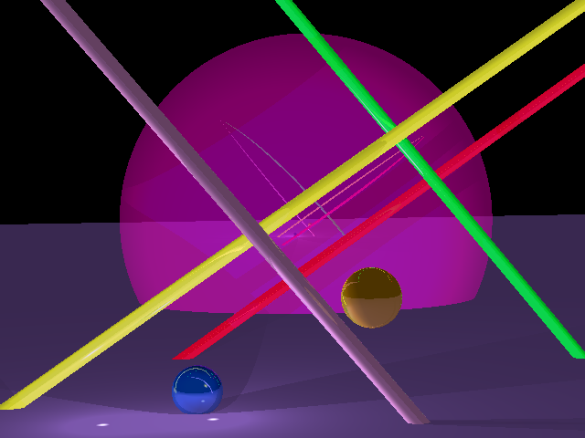
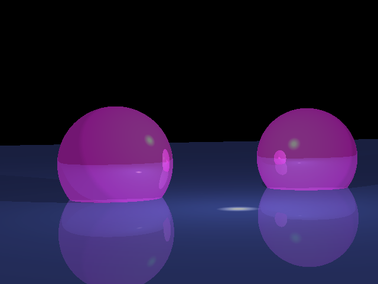
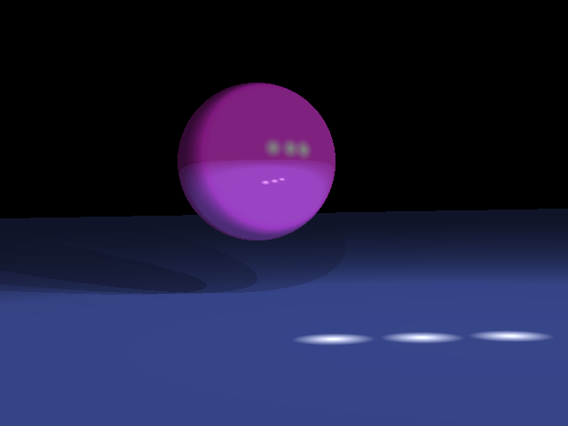
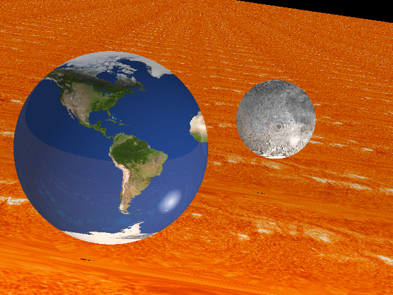
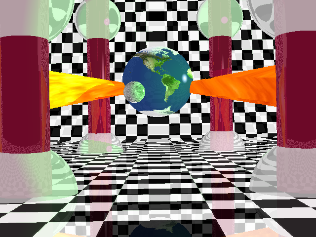

# ray tracing

Man compilation et lancement de programme
-----------------------------------------------
# Avoir telecharger la sdl
 
make (qui execute le fichier Makefile)

Usage: ./rt scene

Move position: w, a, s, d

Up/Down: space, x

Move distance: +, -

Cam angle: t/g, y/h, u/j

Color filter: 2, 4, 5, 6, 8

Light intensity: p, l

Screenshot: c

Save scene: ctrl + e

